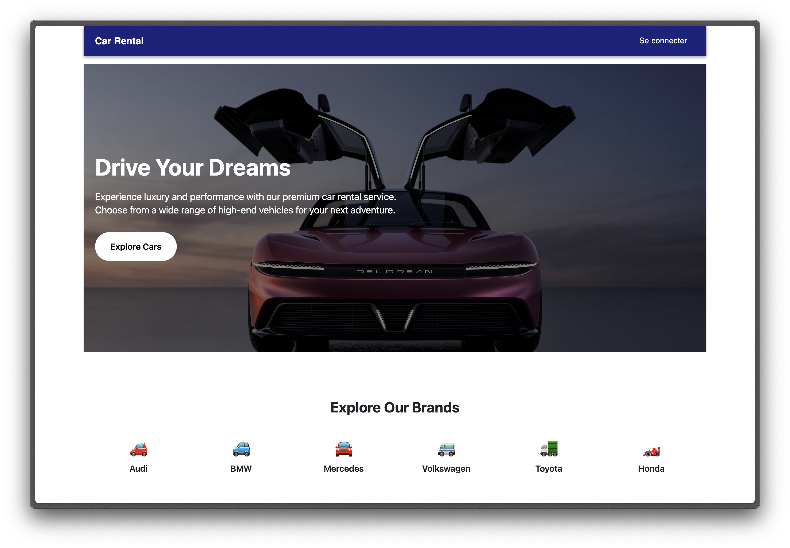
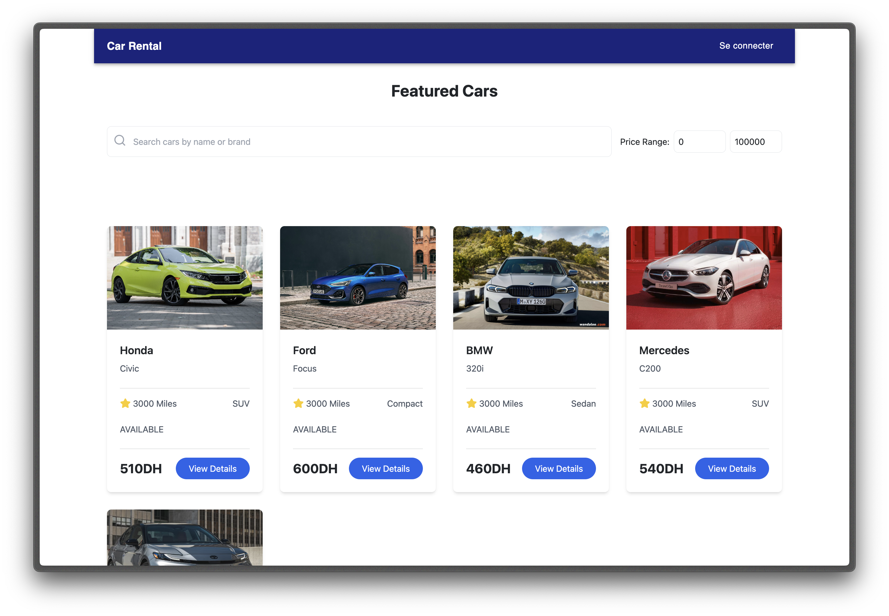
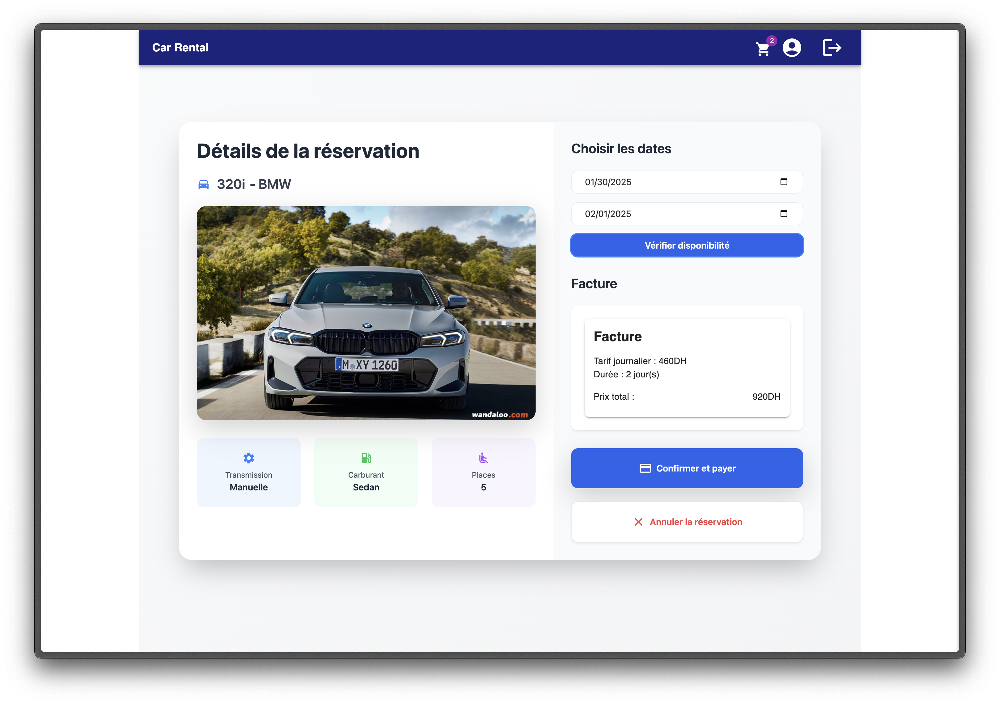
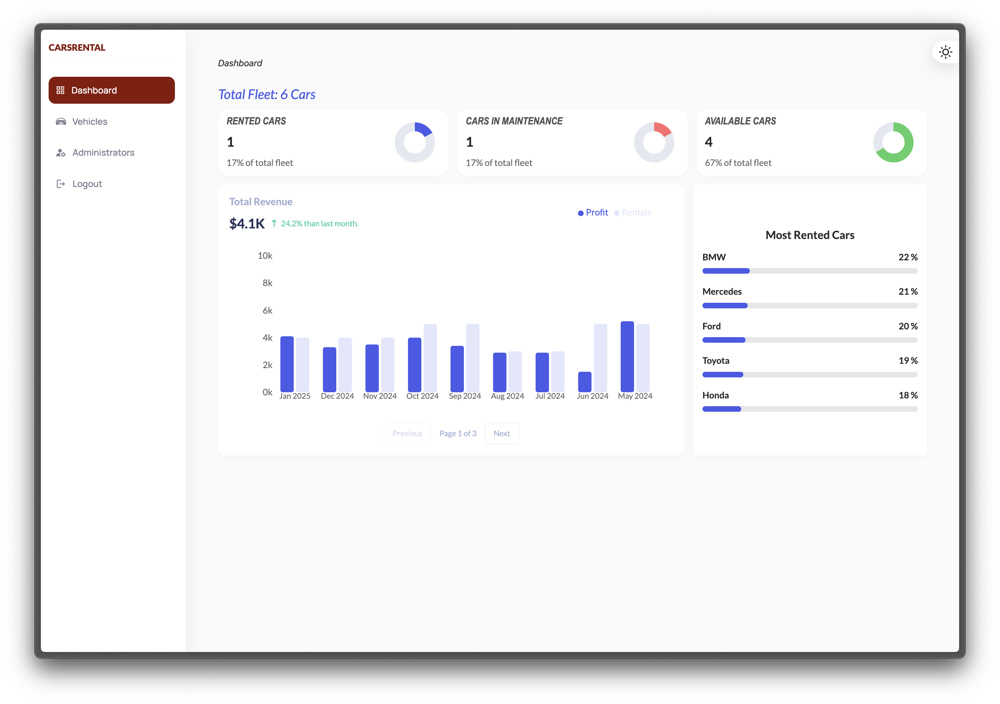
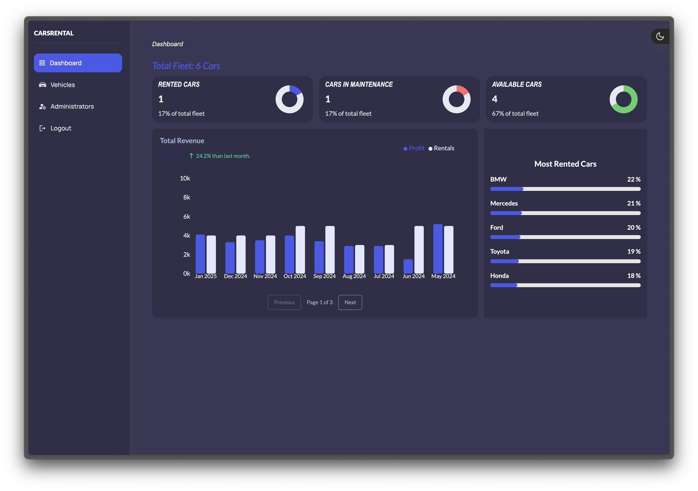
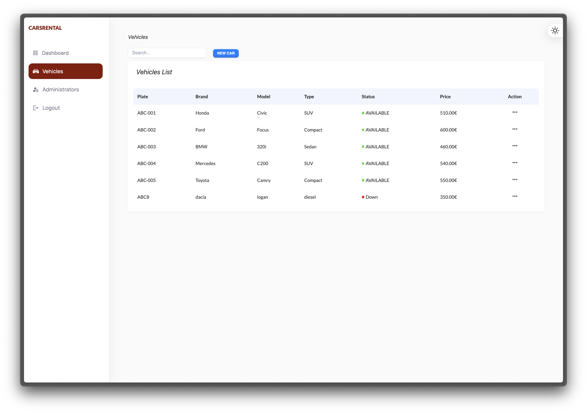

# CarsRental

###     Description : 
Ce projet consiste en la conception et le développement d'une application web interactive pour une agence de location de voitures, destinée à simplifier le processus de gestion et de réservation en ligne.

La plateforme permet aux utilisateurs de rechercher et réserver des véhicules en fonction de critères spécifiques tels que les dates, les types de véhicules, et les tarifs. Elle offre également des fonctionnalités pratiques comme la gestion des profils, la génération de contrats de location, et un système de paiement en ligne sécurisé.

En parallèle, un back-office complet a été développé pour faciliter les opérations internes de l'agence, incluant la gestion centralisée des véhicules, des clients, et des réservations. Ce système permet également un suivi détaillé des paiements, des statuts des véhicules (disponible, réservé, en entretien), et la génération de rapports analytiques pour une prise de décision optimisée.

### Les Fonctionalités 
1.  Gestion des utilisateurs Enregistrement et authentification des utilisateurs (clients et administrateurs). Gestion des profils utilisateurs (modification des informations personnelles : nom, adresse, numéro de téléphone, etc.).
3.  Gestion des véhicules Ajout, mise à jour et suppression de véhicules par l’administrateur. Consultation des véhicules disponibles avec leurs caractéristiques (marque, modèle, année, type, tarif de location).
4.  Réservation de véhicules Recherche de véhicules disponibles par date, type, et filtres spécifiques. Réservation en ligne avec sélection des dates de début et de fin. Confirmation de réservation et génération automatique d’un contrat de location. Gestion des statuts des véhicules (disponible, réservé, en entretien).
5.  Paiement et facturation Calcul automatique du coût total de la location (tarif journalier, durée, frais supplémentaires). Génération de factures. Gestion des paiements en ligne.
6.  Suivi et rapport d'utilisation Génération de rapports mensuels et hebdomadaires sur : Le nombre de réservations effectuées. Les véhicules les plus loués. Les revenus générés.

## Technologies

  
 

## Screens
------->  FrontOffice

------->  BackOffice

